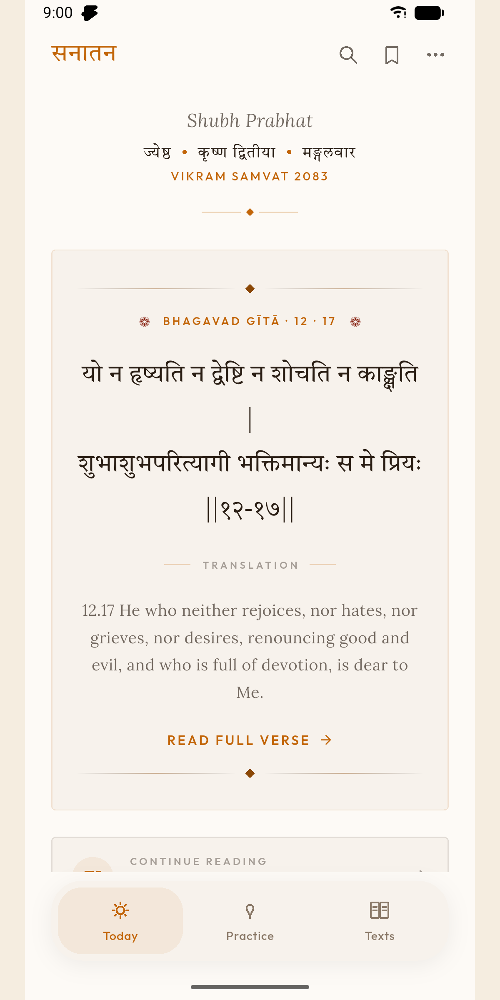
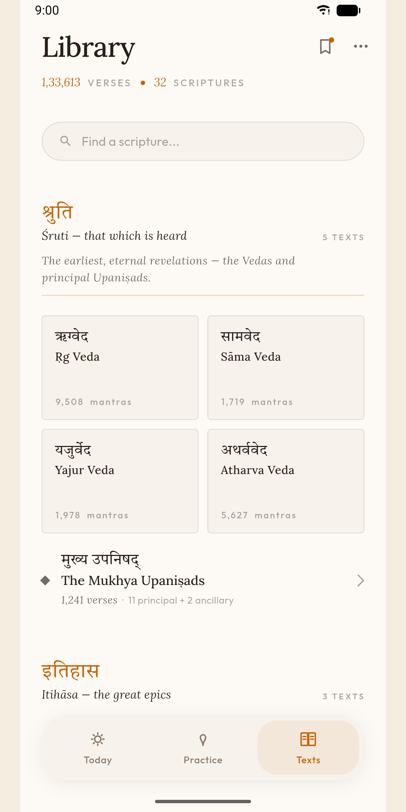
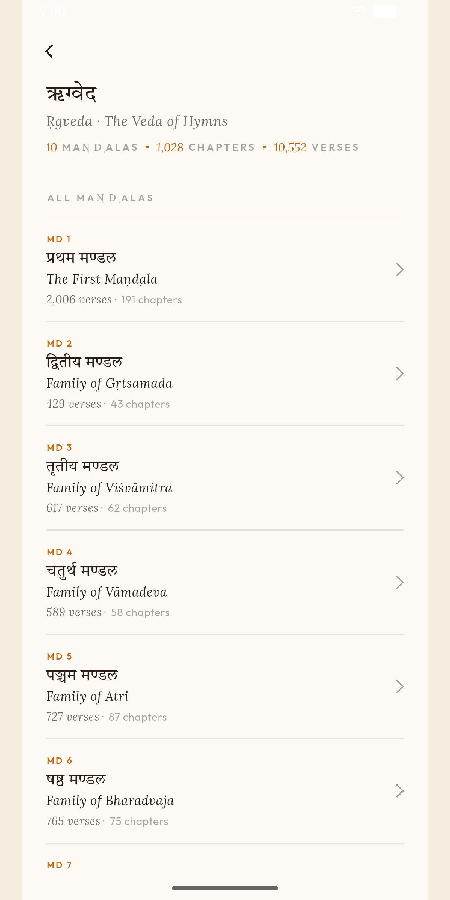
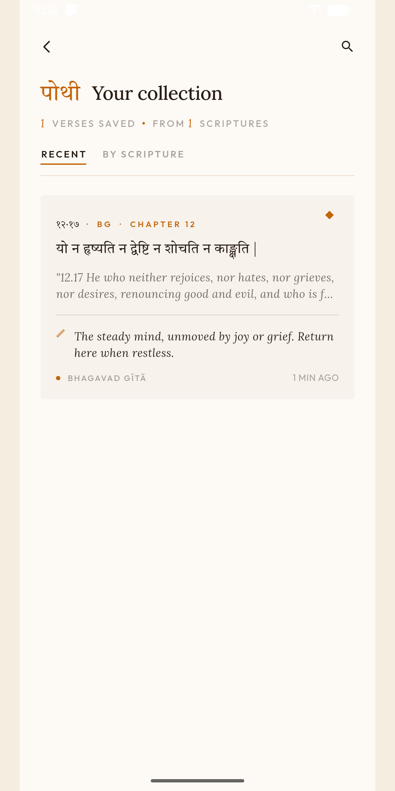
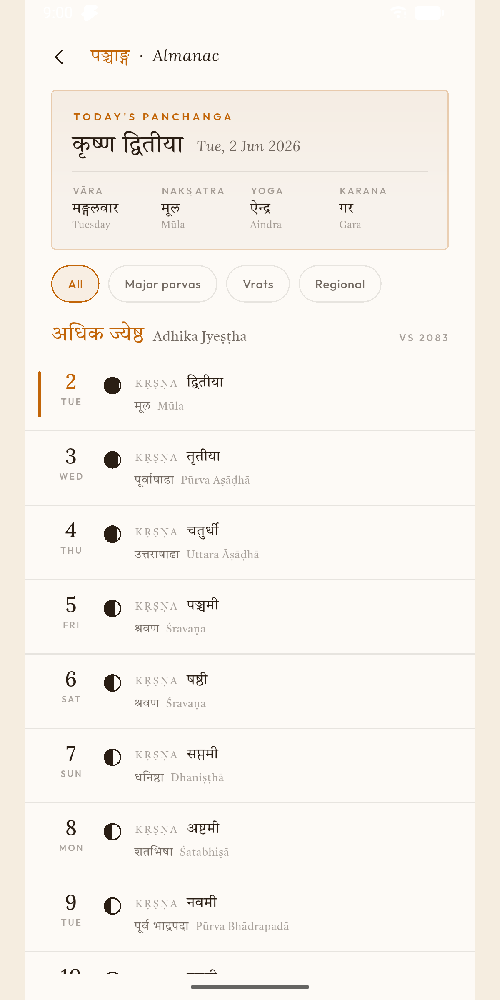

<div align="center">


# 🕉 Sanatan Guide

### Ancient wisdom, beautifully presented.

A calm, scholarly, **offline-first** reading companion for the scriptures of the
sanātana tradition — the Bhagavad Gītā, the four Vedas, the principal Upaniṣads,
the Itihāsas, and more. Built for daily reading, careful reflection, and an
honest conversation with the source texts.

<br/>


<br/>

**32 classical texts · 133,613 verses · No account · No ads · Reads in airplane mode**

</div>

---

## 📱 Screenshots

<div align="center">

| Temple Dawn home | Verse detail | Ask the Pandit | The library |
|:---:|:---:|:---:|:---:|
|  |  |  |  |

| Chapter outline | Search everything | Bookmarks & notes | Festival calendar |
|:---:|:---:|:---:|:---:|
|  |  |  |  |

</div>

---

## ✨ Features

- 🌅 **Temple Dawn dashboard** — a daily verse hero card, a celestial almanac
  (Vāra / Tithi / upcoming Parvas), festival countdowns, and gentle path progress.
- 📜 **Sanskrit original + English translation** — every verse in Devanāgarī with a
  published public-domain translation (Sivananda, Prabhupada, Müller, Griffith,
  others — all attributed). Romanised **IAST transliteration** for the Bhagavad Gītā.
- 🙏 **Ask the Pandit** — when a verse needs unpacking, ask. Replies stay close to
  traditional commentary and link back to the source. Commentary, never verdict.
- 📚 **Read the way you remember** — bookmark verses, take personal notes alongside
  any passage, save AI explanations to your notes, and **search across all texts at once**.
- 🎉 **Festival calendar (2026–2030)** — Pañcāṅga dates with an optional, quiet
  day-of notification for each major parva.
- 🛤 **Learning paths** — short curated modules on dharma, karma yoga, and moksha,
  with milestone badges (*Sadhaka*, *Tapasvi*). Designed for the commute, not the marathon.
- 📴 **Offline first** — the entire scripture library ships inside the app. No login,
  no cloud sync. Open in airplane mode and read.

---

## 📚 The Library

**32 scriptures · 133,613 verses**, the full library bundled on-device as a
pre-populated SQLite database. The largest texts:

| Scripture | Verses | | Scripture | Verses |
|---|--:|---|---|--:|
| Mahābhārata | 72,770 | | Sāmaveda | 1,719 |
| Rāmāyaṇa | 18,761 | | Tirukkuṟaḷ | 1,326 |
| Bhāgavata Purāṇa | 14,031 | | Bhagavad Gītā | 700 |
| Ṛgveda | 9,508 | | Chāndogya Upaniṣad | 623 |
| Atharvaveda | 5,627 | | Bṛhadāraṇyaka Upaniṣad | 432 |
| Arthaśāstra | 5,371 | | …plus 20 more | |
| Yajurveda | 1,978 | | **13 principal Upaniṣads, Yoga Sūtras, Brahma Sūtras, Manusmṛti** | |

Some texts are complete; others ship a curated selection — see `docs/` for the
content-completeness map. Every translation lists translator, source URL, and license.

---

## 🏛 Design — "Sacred Minimalism"

A custom heritage-toned design system that prioritises focus, breath, and cultural resonance.

| Token | Value | Use |
|---|---|---|
| **Saffron** | `#E8820C` | Sparse, intentional — sacred moments + primary actions |
| **Cream** | `#FDFAF6` | Light surface, the feel of an aged manuscript |
| **Ink (dark)** | `#0F0F0F` | Dark-mode surface |
| **Icon backdrop** | `#1A1A2E` | Adaptive launcher-icon background |

**Typography** — Tiro Devanagari Sanskrit (śloka display, full Vedic diacritics),
Noto Sans Devanagari (Hindi UI, widest Unicode coverage), **Lora** (English body),
**Outfit** (UI labels). All fonts are bundled for an offline guarantee and licensed
under SIL OFL 1.1.

---

## 🤖 Ask the Pandit — AI design

A thin, defensive wrapper over the Google Gemini REST API (`lib/core/services/gemini_service.dart`).

- **Model** — `gemini-2.5-flash` (primary + fallback), overridable per-build via
  `--dart-define=GEMINI_MODEL` so a newer tier can be pointed at without a code change.
- **Resilience** — fallback to the prior flash tier on `404/400`; a single same-model
  retry (after 1 s backoff) on transient `503/500`; a **circuit breaker** that opens
  after 3 failures in 60 s and cools down for 2 minutes.
- **Latency** — 25 s request timeout (wall time scales with output length, not just
  network), tightened to 15 s on the retry.
- **Cache** — process-scoped **LRU of 100 replies** so re-opening an explanation is instant.
- **Rate budgets** — per-feature daily caps (chat 10, word-gloss 50, section-theme 40)
  so a first-use burst can't starve "Ask the Pandit".
- **Key safety** — the API key is injected at build time and **restricted to this Android
  app** (package + signing SHA-1) in Google Cloud Console; the raw REST call attaches the
  `X-Android-Package` / `X-Android-Cert` headers manually so the restriction holds.

> The Pandit is **invisible without a key** — pass `--dart-define=GEMINI_API_KEY=...`
> to enable AI features; the app degrades gracefully when it's absent.

---

## 🧱 Architecture

Feature-based **Clean Architecture** — each feature owns its `presentation / domain / data` slices.

```
┌──────────────────────────────────────────────────────────────┐
│  Presentation   widgets · pages · Riverpod providers          │
│                 (9 features: home, scripture_reader, chat,     │
│                  search, bookmarks, festivals, learning_path,  │
│                  settings, onboarding)                         │
├──────────────────────────────────────────────────────────────┤
│  Domain         entities · use-cases · repository interfaces   │
│                 fpdart  Either<Failure, T>  for error handling │
├──────────────────────────────────────────────────────────────┤
│  Data           Drift DAOs · remote datasources · models       │
│                 (Gemini REST · pre-populated SQLite)           │
├──────────────────────────────────────────────────────────────┤
│  Core           services · router · panchanga · utils · errors │
└──────────────────────────────────────────────────────────────┘
```

**Persistence** — SQLite via **Drift** (schema v10, 8 tables: verses, bookmarks,
commentaries, verse_explanations, learning_modules, module_cards, module_extras,
user_module_progress) shipped as a gzipped asset and unpacked on first run.

---

## 🛠 Tech Stack

| Concern | Choice |
|---|---|
| Framework | Flutter 3.19+ (Material 3, Impeller) · Dart 3.3+ |
| State | Riverpod 3 (35+ code-gen providers) |
| Navigation | GoRouter |
| Local DB | Drift / SQLite (offline-first, pre-populated) |
| Networking | Dio · http |
| AI | Google Gemini (`gemini-2.5-flash`) |
| Backend services | Firebase Analytics · Crashlytics · Remote Config |
| Notifications | flutter_local_notifications · timezone |
| Errors | fpdart `Either<Failure, T>` |
| Codegen | build_runner · Riverpod · Drift · Freezed · json_serializable |
| Fonts | google_fonts + bundled OFL TTFs |

---

## 🚀 Build & Run

```bash
# Dev (ads off; Pandit enabled when a key is supplied)
flutter run --dart-define=ADS_ENABLED=false \
            --dart-define=GEMINI_API_KEY=<your-key>

# Release App Bundle for Play upload (Play splits per-device → ~20 MB user APK)
./scripts/release.sh <GEMINI_API_KEY>

# Universal APK for sideload QA
./scripts/release.sh <GEMINI_API_KEY> --apk
```

**Codegen** — after editing any annotated source (Drift / Riverpod / Freezed / json):

```bash
dart run build_runner build --delete-conflicting-outputs
```

**Quality gates** — CI runs both on every push to `main` (`.github/workflows/flutter.yml`):

```bash
flutter analyze && flutter test    # 46 test files
```

---

## 🗂 Project Structure

```
lib/
├── core/          # services (gemini, analytics, notifications), router,
│                  # panchanga engine, utils, errors, extensions
├── data/          # Drift DB, DAOs, tables, remote datasources, models, festivals
├── domain/        # entities, use-cases, repository interfaces
├── presentation/  # 9 features (presentation/domain/data slices) + shared widgets + theme
└── l10n/          # generated localisations (en, hi)

assets/db/         # pre-populated, gzipped scripture SQLite database
assets/fonts/      # bundled Devanagari + Latin fonts (offline guarantee)
store_assets/      # Play listing copy, screenshots, feature graphic
tool/              # one-off content + launcher-icon scripts (not bundled)
docs/              # architecture, audit, and pre-production test reports
```

---

## 📊 By the Numbers

| | |
|---|--:|
| Classical texts | **32** |
| Verses on-device | **133,613** |
| Dart source files | **169** |
| Lines of code (excl. generated) | **~39.7K** |
| Test files | **46** |
| Drift schema version | **v10** (8 tables) |
| App bundle (per-device split) | **~20 MB** |

---

## 🔒 Privacy

No personally identifying data is collected. Notes, bookmarks, and reading progress
live **on the device**. Anonymous analytics and crash reports are **opt-out in one tap**
(Settings → Privacy) and are disabled entirely in debug builds. The Pandit feature sends
only your question + the verse text to Google Gemini — nothing else.

- [Privacy policy](https://gist.github.com/Saurabh-7973/96cf400ffbbbece5ece2d5d4c3f0a16c)
- [Terms](https://gist.github.com/Saurabh-7973/04966e0f9717bba119ddf13e951d3df5)

---

## 📜 License

**Source-available, not open-source.** See [`LICENSE`](LICENSE). The source is provided
for reference and personal study; commercial redistribution and Play Store republication
require written permission. Bundled fonts are SIL OFL 1.1 ([`LICENSES/FONTS.md`](LICENSES/FONTS.md)).

---

<div align="center">

**Sanatan Guide** · Sacred Minimalism · Ancient Wisdom

*Made in Bhārata. With reverence for the ṛṣis.* 🙏

</div>
